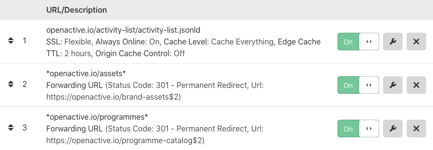

# Documentation for Cloudflare Page Rules within `openactive.io`

Cloudflare Page Rules in use on the `openactive.io` domain are documented within this repository. This documentation must be updated to match the latest configuration for any changes made to Cloudflare Page Rules.

1. Ensures that the JSON-LD version the OpenActive Activity List is maximally cached, to minimise downtime.
2. Provides a redirect for all static assets previously hosted at the `www` subdomain (noting that the Wordpress Redirection Plugin does not handle binary static assets such as images).
3. Some external websites still reference the `beta.openactive.io` domain, from a previous version of the OpenActive website. This redirect ensures such references still resolve.
4. The Gladstone instructional video references "openactive.io/programmes" and does not specify `www`. This redirect ensures that this reference wills still resolve.
